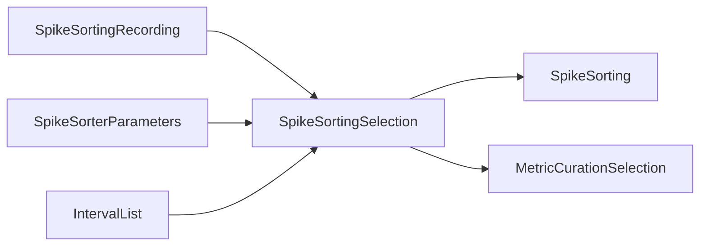

# Implementation plan — `map_si_to_spyglass`, `visualize_schema_neighborhood`, `describe_params`

**Date:** 2026-04-22
**Status:** Superseded / paused as of 2026-04-27.
**Scope:** the three Tier-1 scripts from [llm-script-priorities.md](llm-script-priorities.md). Each closes a distinct LLM hallucination vector. Plan also lands the shared reproducibility envelope and retrofits the two already-shipped scripts to use it.

## Current decision

Do **not** execute this plan as written.

Since this draft, `code_graph.py` and `db_graph.py` became the primary
LLM-facing factual tools. They cover most of the value this plan assigned to
`visualize_schema_neighborhood.py`, `fetch_merge_row.py`, and cardinality
helpers:

- source DAG / table identity / method ownership -> `code_graph.py`
- runtime heading / rows / counts / merge IDs / source-runtime disagreement ->
  `db_graph.py`
- environment/config checks -> existing `verify_spyglass_env.py` and
  `scrub_dj_config.py`

Two parts of this draft remain defensible, but need fresh narrower plans:

- `describe_params.py` / `trace_params.py`, because parameter values live in
  blobs and their effect is determined where `make()` consumes the blob and
  passes values into Spyglass or third-party functions. `db_graph.py` can show
  the row; it does not explain the consumption path.
- `map_si_to_spyglass.py`, because SpikeInterface API compatibility is
  external-package drift rather than a Spyglass source/runtime graph question.

Before reviving any part of this plan:

1. Add evals that require proof-carrying answers from `code_graph.py` and
   `db_graph.py`.
2. Confirm the graph-tool route is insufficient or too awkward for the target
   failure mode.
3. Prefer a narrow reference template before adding a new CLI.

The detailed design below is retained as historical context. Use only the
relevant pieces as starting material for fresh narrow plans; do not revive the
combined three-script PR.

## Goals and non-goals

**Goals.**

- Ship three user / agent-facing scripts under `skills/spyglass/scripts/` that each close a hallucination vector (Params names, schema neighborhood, SpikeInterface API drift).
- Land a shared `scripts/_envelope.py` so every JSON-producing script carries the reproducibility metadata from day 1.
- Retrofit `scrub_dj_config.py` and `verify_spyglass_env.py` to emit the envelope (breaking change to their JSON shape — acceptable, no external consumers).
- Follow the [Design conventions](bundled-scripts-issue.md#design-conventions) (envelope, bounded runtime, never-leak-on-failure for secret-reading, structured evidence, `Lifecycle:` docstring).

**Non-goals.**

- N-hop schema walks (`trace_restriction.py` in the Thin wrappers tier covers cascade; `visualize_schema_neighborhood.py` is explicitly 1-hop).
- `--smart` / DB-aware enrichment on `describe_params` beyond the opt-in `--include-usage` flag.
- Backwards-compatible JSON from the retrofit — zero external consumers, so the envelope lands as a breaking schema update.

## Repo layout changes

```text
skills/spyglass/
├── scripts/
│   ├── _envelope.py                         # NEW — shared reproducibility envelope
│   ├── map_si_to_spyglass.py                # NEW
│   ├── visualize_schema_neighborhood.py     # NEW
│   ├── describe_params.py                   # NEW
│   ├── scrub_dj_config.py                   # modified — emit envelope
│   ├── verify_spyglass_env.py               # modified — emit envelope
│   └── README.md                            # modified — list new scripts
├── references/
│   └── catalog/                             # NEW dir
│       └── spikeinterface_api.yaml          # NEW — map_si catalog
└── tests/
    ├── test_envelope.py                     # NEW
    ├── test_map_si_to_spyglass.py           # NEW
    ├── test_visualize_schema_neighborhood.py # NEW
    ├── test_describe_params.py              # NEW
    ├── test_scrub_dj_config.py              # modified — expect envelope
    └── test_verify_spyglass_env.py          # modified — expect envelope
```

## Shared foundation — `scripts/_envelope.py`

### Contract

```python
def envelope(
    payload: dict,
    script_name: str,
    script_version: str,
) -> dict: ...
```

Wraps `payload` in reproducibility metadata. Never raises — any resolver failure becomes a `null` field, so the output shape is stable regardless of runtime state.

### Envelope shape

```json
{
  "script": "verify_spyglass_env.py",
  "script_version": "0.2",
  "spyglass_version": "0.5.5" | null,
  "spyglass_commit": "a7ddbd3" | null,
  "datajoint_version": "0.14.5" | null,
  "python_version": "3.11.7",
  "timestamp_utc": "2026-04-22T14:10:00Z",
  "dj_user": "alice" | null,
  "dj_host": "db.example.test" | null,
  "payload": { ... }
}
```

### Resolver rules

- `spyglass_version` — `importlib.metadata.version("spyglass-neurodata")`; fall back to `getattr(spyglass, "__version__", None)`; else `null`.
- `spyglass_commit` — `subprocess.run(["git", "-C", path, "rev-parse", "--short", "HEAD"])` with `timeout=1`, only if Spyglass is importable AND the path is inside a git working tree. Else `null`.
- `datajoint_version` — `importlib.metadata.version("datajoint")`; else `null`.
- `python_version` — `".".join(map(str, sys.version_info[:3]))`. Never null.
- `timestamp_utc` — `datetime.now(timezone.utc).isoformat(timespec="seconds").replace("+00:00", "Z")`. Never null.
- `dj_user` / `dj_host` — from `dj.config.get(...)` if datajoint is importable; else `null`.

All resolvers live in `_envelope.py` as private helpers so each can be mocked independently in tests.

### Dependencies

Stdlib only (`importlib.metadata`, `subprocess`, `datetime`, `sys`). Treats `datajoint` and `spyglass` as optional runtime imports.

## Script 1 — `map_si_to_spyglass.py`

### Contract

```text
Usage: python map_si_to_spyglass.py [--si-version X.Y.Z] [--topic TOPIC] [--json]

--si-version   Override version detection (for debugging / hypothetical lookups).
               Default: detect installed via importlib.metadata.
--topic        Emit only one catalog topic (e.g. `waveform_extraction`).
               Default: all topics.
--json         Emit envelope'd structured output. Default: human-readable.
```

### Catalog design

Data lives in `references/catalog/spikeinterface_api.yaml`; the script is a thin reader. The catalog is the source of truth and grows additively as new SI API drifts surface. Initial topics: `waveform_extraction`, `quality_metrics`, `template_similarity`. Each entry:

```yaml
topics:
  waveform_extraction:
    summary: >
      Extract waveforms around spike events. SortingAnalyzer replaced
      WaveformExtractor at SI 0.100.
    apis:
      - name: SortingAnalyzer
        module: spikeinterface.core
        since: "0.100.0"
        deprecated_at: null
      - name: WaveformExtractor
        module: spikeinterface.core
        since: "0.0.0"
        deprecated_at: "0.100.0"
    spyglass_tables:
      - UnitWaveformFeatures
      - MetricCuration
    notes: >
      Spyglass v0.5.5+ is pinned to SI < 0.100 and uses WaveformExtractor.
```

### Output shape

Human-readable:

```text
SpikeInterface 0.99.3 (detected)

waveform_extraction:
  Use: WaveformExtractor (spikeinterface.core)
  Spyglass tables: UnitWaveformFeatures, MetricCuration
  Deprecated at 0.100.0 — upgrade path: SortingAnalyzer.
```

JSON (inside envelope payload): `{"si_version": "0.99.3", "detected": true, "topics": [{"name": "...", "active_api": {...}, "inactive_apis": [...]}]}`.

### Error handling

- SI not installed → emit result with `"si_version": null`, all topics report both APIs with no active pick. Non-zero exit.
- Catalog YAML missing or unparseable → exit 3, stderr names the file.
- `--si-version` with unparseable PEP 440 string → exit 2 with a usage hint.

### Module shape (upstream-ready)

```python
def detect_si_version() -> str | None: ...
def load_catalog() -> dict: ...
def resolve_topic(topic: dict, si_version: str) -> dict: ...
def render_human(resolved: list[dict], si_version: str | None) -> str: ...
def main(argv: list[str] | None = None) -> int: ...
```

Pure functions (`detect_si_version`, `load_catalog`, `resolve_topic`) lift cleanly into `spyglass.spikesorting.utils.si_compat`.

### Dependencies

- `pyyaml` — new skill dependency for catalog parsing.
- `packaging` — already a Spyglass transitive dep; for PEP 440 version comparison.
- Gracefully skips both if absent (emits a `skipped` payload).

## Script 2 — `visualize_schema_neighborhood.py`

### Contract

```text
Usage: python visualize_schema_neighborhood.py TABLE
                                               [--format {text,mermaid,dot}]
                                               [--json] [--depth N]

TABLE      Bare table name (resolved via KNOWN_CLASSES) OR dotted import path.
--format   Output format. Default: text.
--json     Emit envelope'd structured output; format-rendered form goes in payload.
--depth    Hops to include. Default: 1. (v1 only implements depth=1; interface open.)
```

### Output shape

**Text (default):**

```text
SpikeSortingSelection  (dj.Manual, module=spyglass.spikesorting.v1.sorting)

  parents (3):
    ├── SpikeSortingRecording        (dj.Computed, spyglass.spikesorting.v1.recording)
    ├── SpikeSorterParameters        (dj.Lookup,   spyglass.spikesorting.v1.sorting)
    └── IntervalList                 (dj.Manual,   spyglass.common.common_interval)

  children (2):
    ├── SpikeSorting                 (dj.Computed, spyglass.spikesorting.v1.sorting)
    └── MetricCurationSelection      (dj.Manual,   spyglass.spikesorting.v1.metric_curation)
```

**Mermaid:**



**DOT:** standard Graphviz directed graph.

**JSON payload:** `{"root": {"name": ..., "module": ..., "tier": ...}, "parents": [...], "children": [...], "is_part_table": bool, "master": str | null, "rendered": "..."}`. The format-specific string goes in `rendered` alongside the structured lists.

### Table resolution

- Bare name: look up in `validate_skill.py:KNOWN_CLASSES` (imported, not duplicated — so renames stay in sync automatically).
- Dotted path: dynamic `importlib.import_module`; unambiguous.
- Unknown bare name: exit 2 with a message listing a 5-entry sample from `KNOWN_CLASSES.keys()`. Converts typos into actionable output.

### Edge cases

- **Part tables:** `is_part_table=true`, master surfaced in text output prefix.
- **Roots (no parents, e.g. `Session`):** empty `parents` list, text section still rendered.
- **Wide fanout (>20 children):** text output truncates to 20 with `... and N more`; full list in JSON.
- **Mermaid-reserved chars in table names:** escape via Mermaid string-quoting syntax.

### Module shape (upstream-ready)

```python
def resolve_table(name_or_dotted: str): ...
def neighborhood(table, depth: int = 1) -> dict: ...
def render_text(neighborhood: dict) -> str: ...
def render_mermaid(neighborhood: dict) -> str: ...
def render_dot(neighborhood: dict) -> str: ...
def main(argv: list[str] | None = None) -> int: ...
```

`neighborhood()` + renderers lift into `spyglass.utils.dj_graph` as siblings to `RestrGraph` / `TableChain`. Upstream can add restriction-aware flavor (`(MyTable & r).show_neighborhood()`); we're not implementing that in v1.

### Dependencies

`datajoint`, `spyglass`. Graceful skip when absent.

## Script 3 — `describe_params.py`

### Contract

```text
Usage: python describe_params.py (--pipeline P | --table T) [--json]
                                                            [--include-usage]

--pipeline    Named pipeline (SpikeSorting, LFPV1, ...). Resolves to its
              Params table set via hardcoded map.
--table       Single Params table name. Mutually exclusive with --pipeline.
--include-usage
              Walk children to count Selection rows referencing each Params
              row. Opt-in (slow on large DBs).
--json        Envelope'd structured output.
```

### Pipeline → Params map

Hardcoded for review auditability. Each entry is `(fully_qualified_class_path, pk_field)`:

```python
_PIPELINE_PARAMS: dict[str, list[tuple[str, str]]] = {
    "SpikeSorting": [
        ("spyglass.spikesorting.v1.recording.SpikeSortingPreprocessingParameters", "preproc_param_name"),
        ("spyglass.spikesorting.v1.sorting.SpikeSorterParameters",                  "sorter_params_name"),
        ("spyglass.spikesorting.v1.artifact.ArtifactDetectionParameters",           "artifact_params_name"),
        ("spyglass.spikesorting.v1.metric_curation.WaveformParameters",             "waveform_params_name"),
        ("spyglass.spikesorting.v1.metric_curation.MetricParameters",               "metric_params_name"),
    ],
    "LFPV1":                  [("spyglass.common.common_filter.FirFilterParameters", "filter_name"),
                               ("spyglass.lfp.v1.lfp_artifact.LFPArtifactDetectionParameters", "artifact_params_name")],
    "LFPBandV1":              [("spyglass.common.common_filter.FirFilterParameters", "filter_name")],
    "TrodesPosV1":            [("spyglass.position.v1.position_trodes_position.TrodesPosParams", "trodes_pos_params_name")],
    "DLCPosV1":               [("spyglass.position.v1.position_dlc_position.DLCSmoothInterpParams", "dlc_si_params_name"),
                               ("spyglass.position.v1.position_dlc_centroid.DLCCentroidParams",    "dlc_centroid_params_name"),
                               ("spyglass.position.v1.position_dlc_orient.DLCOrientationParams",   "dlc_orientation_params_name"),
                               ("spyglass.position.v1.position_dlc_model.DLCModelParams",          "dlc_model_params_name")],
    "RippleTimesV1":          [("spyglass.ripple.v1.ripple.RippleParameters", "ripple_param_name")],
    "ClusterlessDecodingV1":  [("spyglass.decoding.v1.core.DecodingParameters", "decoding_param_name"),
                               ("spyglass.decoding.v1.waveform_features.WaveformFeaturesParams", "waveform_features_params_name")],
    "SortedSpikesDecodingV1": [("spyglass.decoding.v1.core.DecodingParameters", "decoding_param_name")],
    "MuaEventsV1":            [("spyglass.mua.v1.mua.MuaEventsParameters", "mua_param_name")],
}
```

The validator gets a new check that every class path resolves in the Spyglass source (see Validator integration section). Map drift → validator fails → CI blocks merge.

### Output shape

JSON payload:

```json
{
  "pipeline": "SpikeSorting",
  "usage_counted": false,
  "params_tables": [
    {
      "table": "SpikeSorterParameters",
      "module": "spyglass.spikesorting.v1.sorting",
      "pk_field": "sorter_params_name",
      "rows": [
        {
          "name": "franklab_tetrode_hippocampus",
          "contents": {"detect_threshold": 6.0, "...": "..."},
          "usage_count": null,
          "used_by_tables": []
        }
      ]
    }
  ]
}
```

`usage_counted` is always present so consumers know whether to trust `usage_count` values.

### Error handling

- `--pipeline` name not in map → exit 2, stderr lists valid names.
- Both `--pipeline` and `--table` → argparse rejects via mutually exclusive group.
- A class import fails (Spyglass version drift) → continue with other tables; mark the failed entry's `rows: []` with `"status": "import_failed"`. Don't abort the whole run.

### Module shape (upstream-ready)

```python
def resolve_pipeline(pipeline_name: str) -> list[tuple[type, str]]: ...
def describe_table(table_cls: type, pk_field: str, include_usage: bool) -> dict: ...
def describe_pipeline(pipeline_name: str, include_usage: bool) -> dict: ...
def main(argv: list[str] | None = None) -> int: ...
```

`describe_pipeline()` lifts into `spyglass.utils.params.describe(pipeline, include_usage=False)`. `_PIPELINE_PARAMS` becomes the package's source of truth, reusable by `generate_selection_inserts.py` later.

### Dependencies

`datajoint`, `spyglass`. Graceful skip when absent.

## Tests

### `test_envelope.py`

- `test_envelope_shape_is_stable` — every top-level key present even when resolvers fail.
- `test_envelope_null_fields_when_spyglass_absent` — monkeypatch `sys.modules["spyglass"] = None`; `spyglass_version` is `None`, not missing.
- `test_envelope_timestamp_is_utc_iso8601_z_suffix` — regex match `\d{4}-\d{2}-\d{2}T\d{2}:\d{2}:\d{2}Z$`.
- `test_envelope_never_raises` — monkeypatch each private resolver to raise; envelope still returns.
- `test_envelope_payload_preserved_verbatim` — input dict round-trips unchanged inside `payload`.

### `test_scrub_dj_config.py` (modified)

Update the existing CLI tests that parse `--json` output: `parsed["database.password"]` → `parsed["payload"]["config"]["database.password"]`. Existing 38 assertions otherwise unchanged.

### `test_verify_spyglass_env.py` (modified)

Same shape: `parsed["results"]` → `parsed["payload"]["results"]`; `parsed["summary"]` → `parsed["payload"]["summary"]`. Existing 29 assertions otherwise unchanged.

### `test_map_si_to_spyglass.py`

- `test_catalog_yaml_parses` — load shipped YAML, assert schema per topic.
- `test_resolve_topic_picks_new_api_above_boundary` — SI 0.101 → `SortingAnalyzer` active.
- `test_resolve_topic_picks_old_api_below_boundary` — SI 0.99 → `WaveformExtractor` active.
- `test_cli_filters_by_topic` — `--topic waveform_extraction` returns only that topic.
- `test_cli_json_has_envelope` — output has `script`, `spyglass_version`, `payload`.
- `test_detect_si_version_returns_none_when_absent` — monkeypatch `importlib.metadata.version` to raise.
- `test_override_si_version_via_cli` — `--si-version 0.101.0` overrides detection.
- `test_cli_exits_3_on_missing_catalog` — relocate the YAML, exit 3 with file-not-found.

### `test_visualize_schema_neighborhood.py`

- `test_resolve_table_by_bare_name` — `SpikeSortingSelection` resolves.
- `test_resolve_table_by_dotted_path` — dotted path resolves identically.
- `test_resolve_unknown_table_lists_alternatives` — `Typo` exit 2, stderr samples `KNOWN_CLASSES`.
- `test_neighborhood_structure` — mock DJ table; returns `{root, parents, children, is_part_table, master}`.
- `test_render_text_shows_tier_annotations` — output names `dj.Manual`, `dj.Computed`, etc.
- `test_render_mermaid_is_parseable` — starts `graph LR\n`, every edge line has `-->`.
- `test_render_dot_is_parseable` — starts `digraph` and braces balance.
- `test_part_table_renders_with_master_prefix` — part-table case surfaces master.
- `test_wide_fanout_truncates_text_not_json` — 25 children → text shows 20 + `... and 5 more`; JSON shows all.
- `test_cli_json_has_envelope`.

### `test_describe_params.py`

- `test_pipeline_map_covers_tier1_pipelines` — coverage assertion against the set documented in `llm-script-priorities.md`.
- `test_pipeline_map_paths_resolve` — `skip` gracefully when Spyglass absent; assert every path imports when present.
- `test_resolve_pipeline_returns_all_params_tables` — mock classes, confirm the right set.
- `test_describe_handles_empty_params_table` — structure preserved.
- `test_describe_serializes_blob_contents_as_dict` — dict blobs round-trip through JSON.
- `test_include_usage_counts_children` — mock children, verify counts.
- `test_import_failure_per_table_doesnt_abort_run` — inject an ImportError for one table, assert others still populate and failed table is marked `"status": "import_failed"`.
- `test_cli_mutually_exclusive_pipeline_and_table`.
- `test_cli_exits_2_on_unknown_pipeline`.
- `test_cli_json_has_envelope`.

### Harness note

All tests register the module in `sys.modules` before `exec_module` — required because `@dataclass` resolves types via `sys.modules[cls.__module__]` and `importlib.util.spec_from_file_location` alone doesn't register. Same pattern as `test_verify_spyglass_env.py`; comment once per file.

Run via uvx: `uvx --with pytest --with datajoint --with packaging --with pyyaml pytest skills/spyglass/tests/test_<name>.py`.

## Validator integration

Add three new checks to `validate_skill.py`, each guarded by a regression fixture per the repo's fixture-first rule:

1. **`check_pipeline_params_map_resolves`** — import every class path in `describe_params.py:_PIPELINE_PARAMS` and assert the `pk_field` is a valid primary-key attribute on the class. Catches upstream renames.
2. **`check_si_catalog_paths_resolve`** — for every API named in `spikeinterface_api.yaml`, assert `module.name` imports cleanly under a current SI install (or skip if SI missing).
3. **`check_bundled_scripts_exist`** — each script in `scripts/README.md`'s user-facing list has a corresponding `.py` file, is executable or `python`-invokable, and exposes a module-level `main()` callable.

## Skill integration

Per-script routing, plus a two-line `scripts/README.md` update after each PR.

### `map_si_to_spyglass.py` routing

- [`spikesorting_pipeline.md` § Step 3](../../skills/spyglass/references/spikesorting_pipeline.md) — one-line pointer: "Unsure which SI API to call for waveform extraction in this env? `python skills/spyglass/scripts/map_si_to_spyglass.py --topic waveform_extraction`."
- [`dependencies.md`](../../skills/spyglass/references/dependencies.md) — new short subsection "SpikeInterface API drift" citing the script as the canonical lookup.

### `visualize_schema_neighborhood.py` routing

- [`custom_pipeline_authoring.md` § Extending an Existing Pipeline](../../skills/spyglass/references/custom_pipeline_authoring.md) — pointer: "Before extending, map the neighborhood with `python skills/spyglass/scripts/visualize_schema_neighborhood.py ExistingTable --format mermaid`."
- [`workflows.md` § Cross-Table Joins](../../skills/spyglass/references/workflows.md) — cite script as the fast "what does this table connect to?" answer.
- [`datajoint_api.md`](../../skills/spyglass/references/datajoint_api.md) — footnote under the `.parents()` / `.children()` mentions.

### `describe_params.py` routing

Every pipeline reference adds a one-line pointer at its params-table section:

- [`spikesorting_pipeline.md`](../../skills/spyglass/references/spikesorting_pipeline.md)
- [`lfp_pipeline.md`](../../skills/spyglass/references/lfp_pipeline.md)
- [`position_pipeline.md`](../../skills/spyglass/references/position_pipeline.md)
- [`decoding_pipeline.md`](../../skills/spyglass/references/decoding_pipeline.md)
- [`ripple_pipeline.md`](../../skills/spyglass/references/ripple_pipeline.md)
- [`mua_pipeline.md`](../../skills/spyglass/references/mua_pipeline.md)

### Frontmatter

No change. `allowed-tools: Read, Grep, Glob, Bash` was extended in PR A of the earlier plan; all three new scripts inherit Bash-invocability from that.

### Eval updates

- `map_si_to_spyglass`: new eval or update to an existing spike-sort eval where the expected output would otherwise guess an SI API name.
- `visualize_schema_neighborhood`: update one cross-table eval to accept the script as first-pass exploration.
- `describe_params`: grep evals for `_params_name` substrings; where an eval currently hardcodes a params row name, add a behavioral check "prefers `describe_params.py` over guessing OR correctly ground-truths the row."

Land eval updates in the same PR as each script.

## Phased rollout

Four atomic PRs; envelope first so new scripts depend on it from day 1.

### PR A — envelope foundation + retrofit (~1 day)

1. `scripts/_envelope.py` + `tests/test_envelope.py`.
2. Retrofit `scrub_dj_config.py` and `verify_spyglass_env.py` to emit envelope; update their tests.
3. Commit: `scripts: add _envelope and retrofit existing scripts to use it`.

### PR B — `map_si_to_spyglass.py` (~1 day)

1. Script + YAML catalog + tests.
2. `dependencies.md` + `spikesorting_pipeline.md` routing.
3. Validator check #2 (si_catalog paths resolve).
4. Commit: `scripts: add map_si_to_spyglass (SI API version mapping)`.

### PR C — `visualize_schema_neighborhood.py` (~1-2 days)

1. Script + tests (text / Mermaid / DOT renderers).
2. `custom_pipeline_authoring.md` + `workflows.md` + `datajoint_api.md` routing.
3. Commit: `scripts: add visualize_schema_neighborhood (1-hop DAG)`.

### PR D — `describe_params.py` (~2 days)

1. Script + tests; hardcoded `_PIPELINE_PARAMS` with all Tier-1 pipelines.
2. Six pipeline-reference routing additions.
3. Validator check #1 (_PIPELINE_PARAMS paths resolve).
4. Eval updates (any eval with a hardcoded params-row name).
5. Commit: `scripts: add describe_params + validator coverage + eval updates`.

Each PR leaves the skill in a working state and is reviewable atomically.

## Review workflow (applies to every PR above)

Before each commit, dispatch both reviewers in parallel (single message with two `Agent` tool calls) and address findings:

1. **`pr-review-toolkit:code-reviewer`** — reviews the Python implementation and tests. Specifically: leak-prevention invariants on secret-reading scripts, timeout safety on network-touching code, coverage gaps (especially for envelope fallback branches), upstream-migration readiness of the public functions, test quality.
2. **`general-purpose` agent with skill-design framing** — reviews skill integration: discoverability (which references cite the new script at the right landing points), docstring lifecycle notes, SKILL.md posture changes, eval coverage. The `skill-creator` Skill is NOT available as a subagent — `general-purpose` with a skill-design-focused brief serves the role.

Both reviewers must sign off before the PR's commits land. Their findings often flag real issues missed during implementation (first round found `trodes-to-nwb` false-warn, thread-leak-in-upstream-migration, missing `--strict` end-to-end test, discoverability gaps across 5 references).

## Acceptance criteria

- [ ] PR A: envelope lands; both retrofit scripts emit envelope JSON; existing 67 tests pass after test updates; validator + ruff clean.
- [ ] PR B: `map_si_to_spyglass.py --topic waveform_extraction --json | jq .payload` works against my env; catalog has ≥ 3 topics; both routed references cite script.
- [ ] PR C: `visualize_schema_neighborhood.py SpikeSortingSelection --format mermaid` produces Mermaid syntax; unknown names exit 2 with helpful alternatives; three routed references cite script.
- [ ] PR D: `describe_params.py --pipeline LFPV1` returns non-error output; six pipeline references cite script; validator's `_PIPELINE_PARAMS` coverage check green; at least one eval updated.
- [ ] All new scripts pass `ruff check` and validator; no regressions in the 67 existing tests (plus the new test files' additions).
- [ ] `scripts/README.md` lifecycle table updated after each PR with upstream migration target.

## Upstream migration readiness

When graduating upstream:

- `_envelope.py` → `spyglass.utils.envelope` (or similar); the shape becomes a public reproducibility contract for any Spyglass CLI / diagnostic.
- `map_si_to_spyglass.py` → `spyglass.spikesorting.utils.si_compat` + the YAML as package data. CLI becomes `python -m spyglass.spikesorting.utils.si_compat`.
- `visualize_schema_neighborhood.py` → `spyglass.utils.dj_graph.local_neighborhood()` + `SpyglassMixin.show_neighborhood(format=...)`.
- `describe_params.py` → `spyglass.utils.params.describe()`. `_PIPELINE_PARAMS` becomes the Spyglass-side source of truth reusable by `generate_selection_inserts.py`.

Each migration deletes the prototype and updates skill-reference citations to `python -m spyglass.xxx.yyy`.

## Risks and mitigations

- **`_PIPELINE_PARAMS` silently drifts on a Spyglass release.** Validator check #1 fails fast — fixture-first commit pins the check before we rely on it.
- **`dj.config` shape varies across DataJoint versions.** Envelope resolvers use `.get(key)` with `None` defaults; test against two DJ-config dict shapes.
- **YAML catalog grows unchecked.** Validator warns if `spikeinterface_api.yaml` exceeds 300 lines; at that point split by era.
- **Mermaid output breaks on reserved characters.** `render_mermaid` escapes table names; fixture covers a contrived worst-case.
- **Timezone drift in envelope timestamps.** Test pins to UTC with `Z` suffix — no `+00:00` ambiguity.
- **Breaking JSON change on retrofit.** Zero external consumers confirmed today; if one appears mid-review, fall back to `--json-v1` flag as a compatibility escape hatch.

## Next step

Do not start PR A. First land the graph-tool eval/reference consolidation
described in [llm-script-priorities.md](llm-script-priorities.md). If a new
script remains justified after that, split out a fresh narrow plan for either
parameter tracing or `map_si_to_spyglass.py`; do not revive this combined PR.
